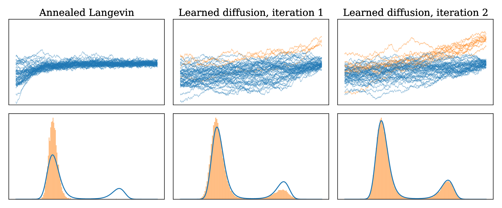

# TTD - Tensor Train Diffusion

Code accompanying **["Tensor Train Diffusion: Leveraging Low-Rank Structures
for High-Dimensional Score-Based
Sampling"](https://openreview.net/pdf?id=DDQX97Xi1Z)** (Gruhlke, Berner,
Sommer, Richter, ICML 2026). The solver casts score-based sampling from an
unnormalized density as a stochastic-control / Hamilton–Jacobi–Bellman (HJB)
problem and solves the resulting PDE with a backward-in-time policy-iteration
scheme, representing the value function as a low-rank **functional tensor
train (FTT)**.

## Background

We want to draw samples from a target density
$p_\mathrm{target} = \rho_\mathrm{target} / \mathcal{Z}$ that can be evaluated
only up to its (intractable) normalizing constant $\mathcal{Z}$, with no
samples available a priori. Following the diffusion-model paradigm, we
consider a noising process that transports $p_\mathrm{target}$ towards a
simple prior $p_\mathrm{prior}$ (e.g. a standard Gaussian) and reverse it in
time. The reversed, *simulatable* dynamics take the form

$$
\mathrm{d} X^u_s = \big(f + \sigma u\big)(X^u_s, s)\,\mathrm{d}s +
\sigma(s)\,\mathrm{d} W_s, \qquad X_0^u \sim p_{\mathrm{prior}},
$$

and the goal is to learn a control $u$ such that
$X_T^{u^{\ast}} \sim p_\mathrm{target}$. The optimal control is the (scaled)
score function $u^{\ast} = \sigma^\top \nabla \log \overleftarrow{p}_Y$, which
can equivalently be characterized as the gradient of
$V := -\log \overleftarrow{p}_Y$, the solution of an HJB PDE:

$$
\partial_t V = -\tfrac{1}{2}\mathrm{Tr}(\sigma \sigma^\top \nabla^2 V) -
f \cdot \nabla V + \mathrm{div}(f) +
\tfrac{1}{2}\big\|\sigma^\top \nabla V\big\|^2, \qquad
V(\cdot, T) = -\log p_\mathrm{target}.
$$

Solving this PDE directly is intractable in high dimensions. Instead, using
the connection between HJB PDEs and backward stochastic differential
equations (BSDEs), the problem is decomposed into a sequence of regression
problems on a time grid $0 = t_0 < \dots < t_N = T$: starting from the known
terminal condition, each $\widehat{V}_n \approx V(\cdot, t_n)$ is fit
backward in time ($n = N-1, \dots, 0$) by minimizing an empirical loss over
simulated trajectories of the discretized SDE, which is affine in
$\widehat{V}_n$ and (up to discretization error) vanishes at the true
solution.

To make this regression tractable in high dimensions, $\widehat{V}_n$ is
represented in an **extended tensor train (xTT)** format: given univariate
orthonormal basis functions $\phi^i_j$ per input dimension $i$ (Fourier,
Legendre, or spline - see `ttd/bases/`), the tensor basis
$\Phi(\boldsymbol{x}) = \bigotimes_i (\phi^i_j(x_i))_j$ is contracted with a
coefficient tensor $\boldsymbol{C}$ held in low tensor-train rank,

$$
\widehat{V}_n(\boldsymbol{x}) \approx \boldsymbol{C}[\Phi(\boldsymbol{x})] = \boldsymbol{C}_1[\alpha_1]
\boldsymbol{C}_2[\alpha_2] \cdots \boldsymbol{C}_d[\alpha_d],
$$

which scales only linearly in the dimension $d$ for bounded rank. This
regression is solved efficiently via **alternating least squares (ALS)**:
each TT core is updated by a local (regularized) linear least-squares problem
while all other cores are held fixed, sweeping back and forth across the
train.

Because the control is only accurate along the trajectories it was trained
on, but training and evaluation trajectories differ, the whole procedure is
wrapped in an **outer loop**: starting from an initial control $u^{(0)}$
(e.g. Langevin or annealed-Langevin dynamics), each outer iteration
re-simulates trajectories under the current control, refits $\widehat{V}_n$
backward in time, and updates the control via
$\widehat{u}_n = -\sigma^\top \nabla \widehat{V}_n$ - progressively aligning
training and evaluation distributions. In practice this converges in very few
(often < 3) outer iterations. See the paper's Algorithm 1 for the full
pseudocode.

<p align="center">
  
</p>

> Overview of the outer-loop refinement on a bimodal 1D double-well target.
> From left to right: annealed Langevin dynamics serve as an initialization;
> by learning the score function along relevant trajectories, TTD iteratively
> refines the sampling process, so that new modes are discovered and sample
> quality improves. The histograms show the terminal samples of the
> trajectories compared against the target density.

## Requirements

`torch`, `numpy`, `scipy`, `matplotlib`, `colorama`, `tqdm`.

## Repository layout

```
ttd/                        # the package
├── bases/                  # univariate/tensor basis families (the φ in Φ(x))
│   ├── fourier.py            extended-Fourier (orthonormal, with linear/quadratic augmentation)
│   ├── spline.py             B-splines and tensor-spline bases (equidistant & general)
│   ├── legendre.py           tensor-Legendre basis + basis-transform machinery
│   └── rank_rules.py         rank-update heuristics (Dörfler, sing-value thresholding, …)
├── tt/                     # tensor-train data structures (the C in C[Φ(x)])
│   ├── core.py               algebraic TensorTrain core (orthogonalization, rounding, rank changes)
│   └── extended.py           Extended_TensorTrain (xTT): basis + TT core, with eval/grad/Hessian
├── solvers/
│   ├── als.py                alternating least squares: the local, per-core regression solve
│   └── backward_iteration.py train(): one backward-in-time sweep fitting V̂_n, n = N-1,…,0
├── problems/
│   ├── base.py               Target base class, StandardNormal / GaussianMixture / SymmetricGaussianMixture2D
│   │                         (bare targets with no TT discretization), GeneralizedProblem + helpers
│   │                         (regularization, scheduling, …)
│   ├── concrete.py           GaussianProblem, Multiwell (+ analytic_reference),
│   │                         GinzburgLandau, Kitagawa
│   │                         - each merges its target's potential math with its TT discretization (self.target = self)
│   └── quadrature.py         Legendre / Hermite quadrature score functions
├── utils/
│   ├── plotting.py           plot helpers
│   ├── sampling.py           sample-generation utilities
│   ├── timing.py             tic/toc
│   ├── numerical.py          misc numerical helpers
│   └── progress.py           tqdm progress bar for the backward training loop
├── sde.py                  drift f / diffusion σ definitions, Euler-Maruyama simulation of X^u
├── evaluation.py           compute_path_statistics: importance-sampling Z / E[||X_T||^2] diagnostics
├── reference.py            ReferenceSolutionGaussianMixture + animate_comparison / coeff_projection_test
│                           diagnostics for GaussianMixture / SymmetricGaussianMixture2D (in problems/base.py)
├── modelclass.py           model wrappers
├── policies.py             Langevin / annealed-Langevin initial-control policies (u^(0))
└── xftt.py                 xFTT / xFTT_t: per-timestep container gluing an Extended_TensorTrain to its control

run_TTD.py                  end-to-end CLI entry point, runs any problem in ttd/problems/concrete.py

tests/
└── test_spline.py            research scratch - not a unit-test suite

docs/img/
└── outer_iterations_multiwell_annealed.png
```

## Code walkthrough

Mapping the algorithm above onto the modules:

1. A **problem** (`ttd/problems/concrete.py`) fixes the target potential
   $-\log \rho_\mathrm{target}$ (`__call__`/`.grad`) together with its TT
   discretization - basis choice, ranks, time grid. `Multiwell` is the
   bimodal double-well target used in the figure above; `GinzburgLandau`,
   `GaussianProblem`, and `Kitagawa` are the other available targets.
2. `ttd/sde.py` simulates the forward controlled SDE
   $\mathrm{d}X_s^u = (f + \sigma u)\,\mathrm{d}s + \sigma\,\mathrm{d}W_s$ via
   Euler–Maruyama, given a control taken from an `xFTT` object.
3. `ttd/policies.py` supplies the initial control $u^{(0)}$ for outer
   iteration 1 (plain or annealed Langevin dynamics).
4. `ttd/solvers/backward_iteration.py:train()` performs one backward sweep:
   for $n = N-1, \dots, 0$ it builds the regression targets from the
   already-fit $\widehat{V}_{n+1}$, and calls into `ttd/solvers/als.py` to
   solve the resulting (regularized) least-squares problem for the TT core
   at time $t_n$, wrapped as an `Extended_TensorTrain`
   (`ttd/tt/extended.py`) built on one of the `ttd/bases/` families.
5. The outer loop (see `run_TTD.py`) repeats steps 2–4: re-simulate
   trajectories under the just-learned control, refit backward in time, and
   update the control $\widehat{u}_n = -\sigma^\top \nabla \widehat{V}_n$ -
   this is exactly what produces the three panels in the figure above.
6. `ttd/evaluation.py` scores the result via importance-sampling
   diagnostics (estimated normalizing constant $\widehat{\mathcal{Z}}$,
   $\mathrm{E}[\|X_T\|^2]$) against the analytically known reference where
   available (`Multiwell.analytic_reference`, `ttd/reference.py`).

## Running the example

```bash
python run_TTD.py
```

By default this constructs a `Multiwell` problem with an extended-Fourier
basis and solves it via the backward policy-iteration training loop
(`train`). Requires `torch`. Every hyperparameter is a CLI flag (run
`python run_TTD.py --help` for the authoritative list); `--problem` selects
which of the five problems in `ttd/problems/concrete.py` to solve.

### General

| Flag | Default | Description |
|---|---|---|
| `--problem` | `multiwell` | one of `multiwell`, `gaussian`, `ginzburglandau`, `kitagawa` |
| `--log_mode` | `progress` | `progress` (tqdm bars) or `detailed` (full per-step ALS output) |
| `--device` | `cuda` | `cuda` or `cpu` |
| `--seed` | `42` | training seed |

### Problem / TT / training

| Flag | Default | Description |
|---|---|---|
| `--d` | `2` | problem dimension |
| `--rank` | `2` | TT rank |
| `--N` | `512` | number of Euler–Maruyama timesteps |
| `--batch_size` | `32768` | training batch size |
| `--K_unif` | `32768` | uniform samples for the initial ALS_L2 fit |
| `--eval_batch_size` | `524288` | batch size for the final path-statistics evaluation |
| `--eval_seed` | `12345` | seed for the evaluation batch |
| `--no_iters` | `2` | number of outer policy-iteration sweeps |
| `--T` | `2.0` | terminal time |
| `--tol` | `1e-4` | ALS convergence tolerance |
| `--reg` | `1e-5 / (10 * 6**d)` | ALS regularization (computed from `--d` if not given) |
| `--p_gradient_extension` | `0.1` | linear-gradient extension fraction outside the learned domain |
| `--filter_traj` | `2.5` | drop trajectories exceeding this magnitude before re-training |

### Basis (extended-Fourier)

| Flag | Default | Description |
|---|---|---|
| `--basis_lim` | `2.3` | basis domain is `[-basis_lim, basis_lim]^d` |
| `--n_basis_main` | `10` | extra trigonometric degree for the primary coordinates |
| `--n_basis_secondary` | `3` | basis degree for coordinates outside `n_double_wells` (multiwell/ginzburglandau only) |
| `--orthonormalize` | `H2` | orthonormalization inner product |
| `--include_linear` / `--no-include_linear` | `True` | include a linear augmentation term |
| `--include_quadratic` / `--no-include_quadratic` | `True` | include a quadratic augmentation term |

### `multiwell` / `ginzburglandau` (shared)

| Flag | Default | Description |
|---|---|---|
| `--n_double_wells` | `d` | number of double-well coordinates (rest are plain Gaussian) |
| `--delta` | `2.0` (multiwell) / `1.0` (ginzburglandau) | double-well separation, or Ginzburg-Landau coupling strength |

### `multiwell` only

| Flag | Default | Description |
|---|---|---|
| `--alpha` | `1.0` | potential scale |
| `--x_shift` | `0.0` | shift of the double-well minima |
| `--tilt` | `0.0` | linear tilt added to the potential |

### `gaussian` only

| Flag | Default | Description |
|---|---|---|
| `--gaussian_var` | `1.0` | isotropic covariance scale (mean is fixed at 0) |

### `ginzburglandau` only

| Flag | Default | Description |
|---|---|---|
| `--beta` | `1.0` | overall energy scale |
| `--kappa` | `1.0` | nearest-neighbor coupling strength |

### `kitagawa` only

| Flag | Default | Description |
|---|---|---|
| `--T_model` | `20` | latent trajectory length (should equal `--d`) |
| `--sigma_v` | `1.0` | transition noise std |
| `--sigma_w` | `1.0` | observation noise std |
| `--nonlinear_strength` | `0.3` | strength of the nonlinear transition term |
| `--data_seed` | `42` | seed for generating the synthetic observed data |

## Citation

```bibtex
@inproceedings{gruhlke2026ttd,
  title     = {Tensor Train Diffusion: Leveraging Low-Rank Structures for High-Dimensional Score-Based Sampling},
  author    = {Gruhlke, Robert and Berner, Julius and Sommer, David and Richter, Lorenz},
  booktitle = {International Conference on Machine Learning (ICML)},
  year      = {2026},
  url       = {https://openreview.net/pdf?id=DDQX97Xi1Z}
}
```
